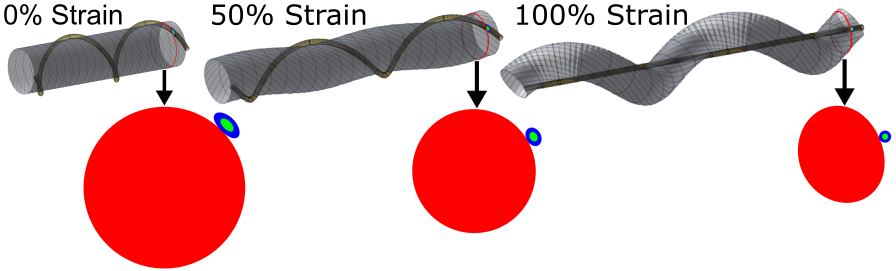

# twister

## Geometric Model for Helical Auxetic Yarn

A Maple script that produces a geometrical model for 2-component helical auxetic yarns at arbitrary strain. The user may specify the following parameters:

- Elastic core initial diameter
- Winding diameter
- Thickness of optional coating on winding (dielectric layer)
- Initial pitch (helical length)
- Elastic core Poisson's ratio
- Final strain
- Number of turns

The geometry generator has the following assumptions:

- At 0% strain, the yarns contain an extensible elastic core fibre with an inextensible winding.
- The extensible fibre geometry is entirely defined by the extensible fibre (i.e. the inextensible fibre deforms as it would without the presence of the core).
- The fibres are locally stiff, so that the contact path between both is a line.

The script generates 3D renderings of the fibre geometries, an animation of extension from 0% strain to the requested final strain, and cross-sectional bitmap images that can be used to estimate electrical properties.

Please cite if this work is useful to you. This script was used in the following publication:
> Cuthbert, T. J., Hannigan, B. C., Shokurov, A., & Menon, C. (2023). HACS: Helical Auxetic Yarn Capacitive Sensors that Go Beyond the Theoretical Sensitivity Limit. _Advanced Materials_, 35(10). https://doi.org/10.1002/adma.202209321

## Example Animation

Below is an example animation of a fibre with parameters (0.2, 2, 0.05, 4, 0.4, 1, 2)

©2023 ETH Zurich, Brett Hannigan; D-HEST; Biomedical and Mobile Health Technology (BMHT) Lab; Carlo Menon